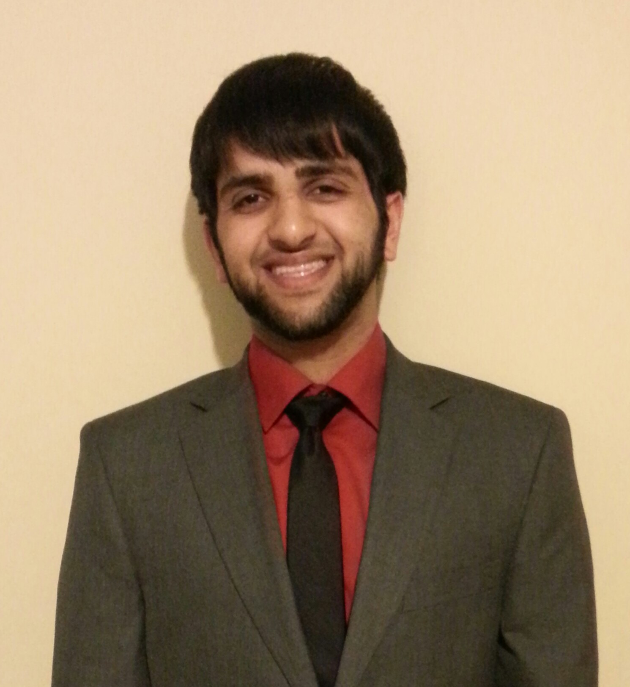

title: Profiles
date: 2014-07-20 10:57:05
---

 
####Osama Sakhi

  

I'm a second year student here at Georgia Tech studying Computer Science, and I'm also the Webmaster for IEEE. I'm a Linux fanatic and I enjoy working on web apps in my spare time. I've completed internships at Standard Code and BitPay, I'm mainly involved with the startup community  here in Atlanta. My interests at the moment are Robotics, AI, and Modeling and Simulation.  
    

  

